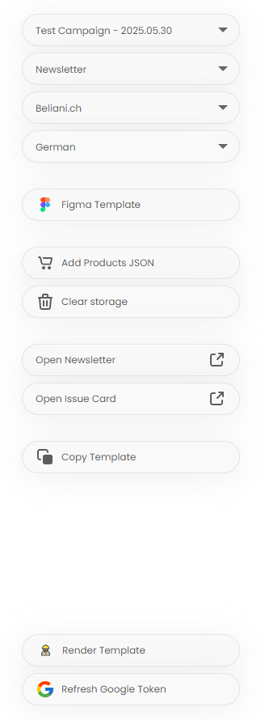

# Constructor Project
### `🎯` Old readme.md has been moved → [click to open](docs/README.md)

### Important Links:
- [Task Description](docs/task.md) 
- [Task Progress](docs/progess.md) 
- [Optimization Plan](docs/optimization_plan.md)

### Changes:
- Constructor UI+UX frontend rework:

- shortened app.js to ~20 lines
- modularized initApp.js
- move legendary demczenko code to local files
- change static state use to getter and setter (getState(), setState()) 
- upgrade translations system
- added test campaign (needs upgrade) to test functions, components, campaign entity
- 